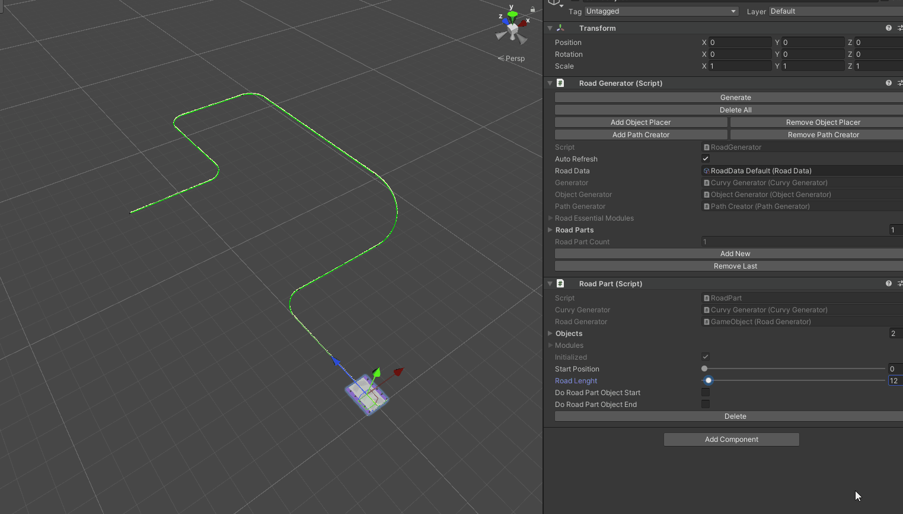

## CurvySplines Level Editor Plugin

A plugin that uses Curvy Spline v7.1.2 to easily create mobile runner style levels in a non-destructive way.
Contains lots of boiler-plate code for creating nodes in Curvy Generator Graph. 

## Road Generator

Main script that sets up all components for curvy splines generator stuff.

## Road Data

A scriptable object that has settings of spline and plugin. Can be assign to Road Generator.

## Road Part

Can be added and removed from Road Generator script by pressing Add New and Remove Last(removing latest added) Buttons.

A Road Part is a way to Deform spline road mesh into slices. Start position and Road Lenght can be altered to make empty spaces on the level. Start or End positions of the road part can have their own objects placed automatically. These objects are set from road data. 

It was on my todo list to make it more customizable by assigning these prefabs to the road part script.

You can see three different road part in image bellow:

## Object Placer

This script can be added from Road Generator to achive easy object placement capability. Add new object group and place collectables or just a single door along the spline with various settings. 

## Path Generator

This component enables you to direct the spline path to your need. Adding left and right turns can be achived by pressing one button. A Path Part component is added for each turn. Previous parts can be changed easily without destroying anything. All the components in this plugin responds correctly.

